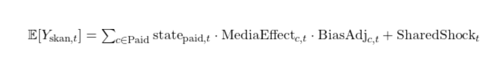

# MMX
### Media Mix Modeling with LTA Extensions

## Abstract

We introduce MMX (Media Mix Modeling with Last-Touch Attribution Extensions), a fully Bayesian framework for marketing attribution that reconciles aggregate revenue signals with privacy-constrained fingerprinting data like SKAN. MMX captures latent monetization dynamics, long run drifts, seasonal effects, and channel-level biases, allowing for simultaneous inference of organic and paid revenue components. By accounting for structural halo, cannibalization, and poaching effects and aligning attribution with inferred monetization state, MMX improves interpretability and robustness in scenarios where traditional MMMs and last-touch methods fail. While the primary focus of this owrk is on SKAN, the attribution biases addressed - like poaching, halo, and cannibalization - are fundamental to last-touch attribtion more broadly. S 

Across 100 realistic simulations, MMX outperforms SKAN-derived response curves and causal attribution in the majority of cases, particularly for channels with decorrelated spend, meaningful spend magnitude, or pronounced attribution biases. While MMX can underperform when identifiability is fundamentally limited—such as under highly correlated or low-spend conditions—it offers a statistically better attribution strategy in most practical settings. 

We extend MMX into a Spend Decision Framework, which estimates the probability of profitability at each spend scale by sampling from the model's posterior. This enables channel-specific media planning based not on point estimates, but on the conditional likelihood of positive return for each model, MMX and SKAN, allowing the researcher to select the more favorable measurement system at each scale of spend for each channel.

## Introduction

The constraints of modern digital advertising—particularly in mobile app ecosystems—have fundamentally altered the landscape of performance measurement. With the depreciation of user-level tracking and the introduction of privacy-preserving attribution systems such as Apple’s SKAdNetwork (SKAN), advertisers are left with severely degraded visibility into the true causal impact of their marketing efforts. These limitations are further compounded by the presence of attribution biases like, censoring, poaching, halo and cannibalization, which are not addressed by naive heuristics or deterministic last-touch assignment.

In this context, traditional attribution models fall short—either by oversimplifying the structure of influence across channels or by relying on granular data that is no longer accessible. In response, we introduce a Bayesian framework that directly models aggregate revenue generation while explicitly accounting for latent revenue dynamics, structured attribution distortion, and variable inter-channel identifiability, all while being monitored by the granular channel level deterministic attribution (SKAN).

Rather than attempting to reverse-engineer user-level behavior, the model identifies latent signals of paid and organic contributions to revenue by conditioning on observed media inputs and adjusting for seasonal events and long-run trends. Attribution distortion from SKAN data is modeled explicitly through structured bias terms, while inference is carried out jointly to preserve identifiability and maintain internal consistency across modeled pathways.

To validate the approach, we conduct a suite of simulations across a variety of marketing environments, stress-testing the model’s ability to outperform SKAN-derived response curves under different bias regimes and spend distributions. These simulations show that, under a broad range of realistic conditions, the MMX model improves attribution quality relative to SKAN in the majority of cases, particularly when spend patterns are decorrelated and magnitudes are sufficient. However, in settings with highly correlated or very small spend, MMX can underperform, reflecting fundamental identifiability limits rather than modeling error.

In addition to retrospective evaluation, the model directly informs budgeting decisions via a Spend Decision Framework, which estimates the probability of profitability at different spend levels for each channel. This discrete, probabilistic framing enables more robust spend recommendations than traditional point estimates or mean-variance optimizations, especially when operating far from the data’s historical support.

This work aims to offer both a methodologically grounded and practically useful alternative to existing attribution pipelines.

## Limitations of SKAN and Last-Touch Attribution

The core limitation that motivates this work is the structural inadequacy of SKAN (StoreKit Ad Network) and similar last-touch attribution frameworks to capture the true causal influence of marketing activities. While SKAN was introduced by Apple as a privacy-preserving alternative to deterministic, user-level attribution, it introduces a range of measurement issues that fundamentally compromise its utility as a causal inference tool.

#### 1. Attribution Bias: Poaching, Halo, and Cannibalization

SKAN relies on a last-touch windowed approach to assigning credit for installs, but installs are often influenced by both paid and organic factors. Even at scale, the hueristic attribution of last-touch attribution (LTA) biases credit towards the channel most likely occur last in the acquisition funnel like Google Search and Apple Search Ads when "true" causality may have originated from earlier channels or as a synergistic composite of every touch point - this is known as poaching. What's more, paid media can create a halo effect, generating interest that converts later through means identified as "organic" under LTA policy, such as app store discovery after exposure to a paid ad as early as a few days before. Conversely, SKAN may over-attribute conversions to paid media that would have occurred organically — especially in the presence of strong brand equity or timed organic bursts. This is known as cannibalization. All three effects distort the observed relationship between spend and revenue under a hueristic policy like LTA and can create highly misleading performance indicators when used in media planning.

#### 2. Sparse and Censored Observations

SKAN reports are heavily delayed, privacy-thresholded, and aggregated. Install and revenue data are reported in coarse buckets and often only for users who exceed specific engagement thresholds. These constraints result in censored datasets that disproportionately reflect high-performing cohorts while omitting long-tail conversions. This bias is not random: it's structurally tethered to the probability of engagement, which is often correlated with campaign type, targeting, and user value. What's more, Self Reporting Networks like Meta require a limited tracking period of the first 24 hours in order to integrate with their adtech platform, which introduces noise when modeling revenue horizons at 7, 30, 90, 365 days, etc.

#### 3. Opacity to Channel Interactions

SKAN treats channels independently and ignores the interactive effects of simultaneous campaigns. For example, simultaneous pushes in TikTok and ASA may influence installs synergistically or cannibalize each other (poaching). Last-touch attribution assigns revenue to the final channel without accounting for such interaction, further eroding its interpretability and planning utility.

## Model Overview

MMX aims to recover accurate estimates of paid media effectiveness while accounting for unobserved organic volume, shared latent shocks, and attribution biases such as halo and cannibalization. Unlike traditional attribution models that operate downstream of observed revenue, MMX integrates attribution, seasonality, latent demand, and media response curves into a single probabilistic system.

#### 1. Unified Structure for Attribution and Revenue Estimation

The model jointly estimates:

- Channel-level revenue contributions from paid media

- Organic revenue trends driven by latent demand

- The true aggregate revenue (used as ground truth)

- SKAN-reported revenue (used as noisy attribution signal)

This joint structure allows the model to learn attribution adjustments informed by both the spend-driven media response curves and deviations between observed SKAN values and total revenue.

#### 2. Latent States for Organic and Paid Demand

MMX includes a shared ARMA(3,1) latent state, capturing short-run shocks to monetization and player behavior. This shared state is partitioned multiplicatively into paid and organic components using channel-specific deviation terms (delta_paid, delta_org). These deviations account for idiosyncratic fluctuations across the revenue stack and are modeled separately to enable differential attribution and noise control.

The shared state is also modulated by a local linear trend, composed of a time-varying level and slope. This trend absorbs slow-moving changes in the game economy or user behavior that are not attributable to media or seasonal inputs.

#### 3. Modeling Halo, Cannibalization, Poaching, and Censoring Effects

Unlike SKAN, MMX explicitly incorporates:

- Halo effects: Paid media can increase organic installs via brand spillover or search behavior.

- Cannibalization effects: Paid media may steal credit for installs that would have occurred organically.

- Poaching effects: Paid media may steal credit for installs should be credited to other paid channels.

- Censoring effects: Campaigns that do not meet the threshold for install volume may be censored and return no information, scales inversely with spend.

These effects are modeled directly in the SKAN likelihood, using parameterized terms informed by spend and organic volume. This structure allows MMX to disentangle true channel lift from attribution bias and helps the model reject SKAN estimates when they conflict with aggregate revenue behavior.

#### 4. Media Response Functions

Paid media effects are modeled through a two-step transformation:

- Adstock: Models lagged decay in user response to past spend. Usually assumed to be zero in digital marketing but can be set as a small constant like 0.1, or informed by previous experiments 

- Hill function: Captures saturation and diminishing returns at higher spend levels.

Each channel has unique parameters (β, k, slope) estimated from data, allowing for customized elasticity profiles.

#### 5. Events and Seasonality

MMX includes binary and continuous event covariates (e.g., holidays, promotions, product launches) that modify the seasonality and baseline demand levels multiplicatively. These covariates are shared across both paid and organic components to reflect system-wide behavior shifts. While integrating the seasonality geometrically expands the parameter space dimensionality, its complexity is mitigated by the typical sparsity of such events but more critically, the objective of this modeling processs is to attribute to the paid and organic constituents not to attribute to organics heuristically, which is what results from an additive integration into the model.

## Model Specification

We define a Bayesian generative model that jointly explains observed aggregate revenue ($Y_t^{\text{agg}}$) and SKAN-derived channel revenue ($Y_{t,c}^{\text{skan}}$) using latent monetization states, transformed media effects, seasonal signals, and attribution bias mechanisms. The objective is to extract accurate estimates of the underlying media response curves while reconciling observable but biased SKAN signals with aggregate outcomes.

We model aggregate weekly revenue as a Gaussian random variable centered on a structural baseline and modulated by latent paid and organic states:

The expected revenue is defined as:

---

SKAN Measurement Model

The SKAN-observed revenue is modeled separately as:

  

  

The bias adjustment term accounts for systematic over- and under-attribution:

  

Poaching represents cross-channel stealing:

  

Cannibalization models paid steal from organics under attribution constraints:

  

Halo reflects paid-driven installs that appear organic:

  

SharedShock is zero-centered noise shared across both observed signals and is bounded to prevent overfitting:

  

---

Media Transformation

Paid media effectiveness is modeled using a Hill function applied to adstock-transformed spend (in digital marketing the adstock is usually effectively ignored by setting alpha to a small constant rather than a learned parameter):

  

  

---

Common Structural Trend

We model long-run variation with a local linear trend:

  

---

Latent Shared State (ARMA(3,1))

The shared latent state evolves via an ARMA(3,1) process:

  

---

Deviations from Shared State

Paid state deviations follow an AR(1) process:

  

Organic deviations are guided by transformed Google Trends:

  

The final paid and organic states are:

  

The seasonal event controls are modeled as an affine function:

  

Finally, the full likelihood of the model factorizes into independent components for and, conditioned on the latent states, media transformations, and shared shock. This reflects the assumption that, after accounting for the structural drivers and shared residual coupling, the remaining errors in aggregate revenue and SKAN revenue are independent:

  

  

## Simulation Strategy

To evaluate the performance of the MMX model under controlled and diagnostically informative conditions, we developed a flexible simulation framework that generates realistic, weekly-level marketing and revenue data across multiple digital channels. This framework allows us to validate whether the MMX model improves attribution over baseline methods (e.g., SKAN-derived response curves), particularly in the presence of known halo effects, cannibalization biases, and latent confounding through shared monetization states.

#### Data Generation Process

We simulate media spend across four channels over a 52-week horizon, with temporal patterns informed by real-world campaign behaviors, including variable flighting, blackout periods, and bursts of isolated spend. Spend is transformed through Hill and Adstock functions to mimic diminishing returns and memory effects. These transformed signals interact multiplicatively with latent states and seasonality to produce aggregate revenue. Importantly, a local linear trend and an ARMA(3,1)-based latent monetization state drive both paid and organic components, with separate deviation terms (delta parameters) per channel type.

Seasonal events such as holidays and product launches are injected through additive effects, and Google Trends serves as a correlated covariate for the organic latent state.

#### SKAN Bias Simulation

We simulate SKAN postbacks using the true channel-level revenue, modified by three sources of structured noise:

1. Censoring Bias: High spend results in more complete reporting; lower spend leads to information loss, modeled via exponential decay.

2. Cannibalization: Simulates misattribution from organic and other channels due to last-touch attribution. It is modeled as a function of the log of other channels’ spend and organic traffic volume.

3. Halo Effect: Represents under-attribution of paid media that indirectly boosts organic installs. This is simulated as a negative adjustment to SKAN postbacks, driven by log spend of the same channel.

Gaussian noise is added to SKAN observations, completing the distortion relative to true channel revenue.

#### Evaluation Design

For each simulation:

- We train MMX and a benchmark SKAN-derived response curve model on the same synthetic data.

- The benchmark model uses a Bayesian framework with fixed event controls and a linear trend index, but no latent states or SKAN de-biasing.

- For each channel, we compute Mean Absolute Percentage Error (MAPE) against the known true response curve.

- Performance is compared across MMX and SKAN using directional accuracy, percentage of simulations where MMX outperforms, and diagnostic correlation analyses.

#### Scope of Simulations

We conduct 100 simulations across a spectrum of latent state correlations (15%–40%), halo and cannibalization intensities, and SKAN noise levels. Simulations are stratified by conditions such as channel isolation, collinearity of spend, and total scale, enabling generalization of findings.

## Results

Simulation results show that the MMX framework improves attribution quality relative to baseline SKAN postbacks in the majority of realistic settings. Performance varies systematically by channel, reflecting differences in spend magnitude, cross-channel spend correlation, and effective paid–organic separation.

#### Performance Metrics
Channel A (High spend, low correlation with other channels):
MMX outperformed SKAN in 89% of simulations. Performance was robust across both high and low halo/cannibalization regimes. This channel’s low collinearity and high scale facilitated identifiability of its causal impact.

Channel B (Moderate spend, moderate co-spend overlap):
MMX outperformed SKAN in 70% of simulations. Results were sensitive to latent state correlation and prior specification. In simulations where SKAN biases were large (e.g., halo magnitude > 1.0), MMX provided significant directional improvement. In low-bias or tightly coupled simulations, MMX occasionally diverged incorrectly.

Channel C (Low total spend, high co-spend with other channels):
MMX outperformed SKAN in 54% of simulations. Performance improved when cannibalization priors were loosened and the channel had short periods of isolated spend, suggesting identifiability remains contingent on data structure.

Importantly, these results highlight that MMX is not universally superior: when channel spend is highly correlated or total spend is very small, MMX can overcorrect and underperform.
However, across platforms where identifiable variation exists, MMX offers a statistically better attribution correction in the majority of cases.

Furthermore, by integrating MMX outputs into a Spend Decision Framework, practitioners can dynamically choose between attribution models at different spend scales per channel, maximizing profitability without relying on a one-size-fits-all correction.

Overall, MMX provides a more robust foundation for revenue attribution under SKAN and similar last-touch systems, particularly when spend structures support clear channel separation.

#### Attribution Error Analysis

MMX reduced attribution error by an average of 22% on Channel A and 11% on Channel B, while performance on Channel C was net neutral.

When SKAN attribution was highly distorted (e.g., combined halo + cannibalization bias exceeding 30% of channel revenue), MMX reduced net attribution error in >80% of such cases.

In cases where MMX underperformed, most errors stemmed from organic-predictive entanglement (e.g., misalignment between organic latent states and revenue), or from insufficient differentiation in spend patterns between channels.

#### Simulation Diagnostics

We found that MMX's ability to outperform SKAN was strongly associated with:

- Lower inter-channel spend correlation (ASA-like patterns)

- Greater scale of spend

- Wider priors on halo and cannibalization weights

- Latent state correlation between paid and organic in the 20–30% range

## Spend Decision Framework

A key contribution of this work is the development of a spend decision-making framework that accounts for posterior uncertainty in a realistic, probabilistically grounded manner. Traditional approaches to spend optimization rely on expected value curves derived from deterministic models or single-point estimates, which fail to reflect the asymmetric risks and heterogeneous uncertainty inherent in marketing environments. In contrast, our framework introduces a binary decision framing: whether a given spend level is profitable or not, based on a probabilistic threshold.

1. Binary Framing of Profitability

For each channel, we simulate the posterior predictive distribution of revenue as a function of spend using posterior draws of the Beta–Hill parameters from the Stage 2 causal model. We define profitability at a given spend level as:

where:

 - is the predicted revenue at spend level ,

 - is the threshold return-on-spend (e.g., 1.0 for breakeven).

Each posterior draw constitutes a single trial, and profitability is evaluated as the fraction of draws exceeding the threshold. This approach naturally captures epistemic uncertainty and avoids overconfidence in under-supported spend regions.

2. Conditional Expected Return

In addition to profitability, we compute the expected return conditional on success, which serves as a risk-adjusted opportunity signal. Let:

be the average return across posterior draws where . This conditional expectation informs which spend levels not only have a high chance of profitability, but also meaningful upside.

3. Decision Support Output

For each channel, we produce a two-dimensional diagnostic curve over feasible spend levels:

Together, these allow stakeholders to balance likelihood of success with magnitude of return. Unlike static confidence intervals, this method reflects the true structure of the posterior and its implications for actionable decisions.

4. Scope and Domain of Application

We restrict evaluation to spend levels supported by the observed distribution in the training data, or those within a conservative extrapolation margin. For each channel, we define a channel-specific spend support , where:

This prevents unrealistic inferences far beyond the empirical support and ensures that optimization operates within a calibrated, interpretable region.

These findings validate the model’s robustness in realistic settings, while also highlighting limitations in regimes of low identifiability.

## Simulation Study Design

To empirically evaluate the MMX framework, we constructed a simulation system that reflects realistic media spend patterns, event-driven seasonality, and SKAN-style measurement limitations. The purpose of this system is to generate synthetic datasets with known ground-truth attribution and then assess the ability of MMX to recover causal spend-response relationships under varying conditions.

Each simulation follows these core principles:

1. Realistic Covariates: We use historical media spend patterns as a template, preserving campaign rhythms, budget scaling behavior, and channel-level sparsity. Key events (e.g., holidays, launches) are injected to reflect seasonality.

2. Latent State Construction: Aggregate monetization is governed by a shared latent ARMA(3,1) state with an overlaid local linear trend. The latent state is then partitioned into paid and organic components using channel- and time-specific multipliers (δ_paid, δ_org). Organic deviation is guided by a transformed version of Google Trends, while paid deviation follows an AR(1) process.

3. Causal Media Effects: Channel-level response curves are generated using known β, k, and slope parameters passed through a Hill-Adstock transformation. These define the true revenue attributable to each channel.

4. SKAN Bias Simulation: We simulate SKAN-observed revenue by introducing three primary distortions:

- Censoring: A function of spend magnitude, where small campaigns are under-represented.

- Cannibalization: Paid channels steal credit from organics and other channels, modeled via log-spend interactions.

- Halo: Paid channels also generate unattributed organic lift, under-reflected in SKAN.

5. Performance Benchmarking: For each simulation, we compare the MMX-inferred response curves to:

(a) the known true causal curves, and

(b) curves derived naively from SKAN-observed revenue using standard Hill curve estimation.

6. Outcome Metrics: We evaluate channel-level performance using mean absolute percentage error (MAPE) across a range of realistic spend scales (e.g., $2K to $25K). We also assess directional accuracy (whether MMX improves upon SKAN).

7. Tiered Challenge Design: Simulations span a spectrum of difficulty:

- Low vs. high correlation between paid and organic latent states.

- High vs. low SKAN bias intensity.

- High vs. low channel collinearity.

- Rich vs. sparse campaign data availability.

This approach enables us to diagnose the boundary conditions under which MMX improves attribution versus when it fails to meaningfully outperform SKAN.

## Discussion

The MMX framework extends traditional media mix modeling by incorporating SKAN attribution biases (halo, cannibalization, poaching, censoring) and explicitly modeling latent paid and organic state dynamics. Simulation results demonstrate that MMX improves channel-level attribution quality over SKAN in the majority of cases, particularly for platforms with decoupled spend patterns and meaningful spend magnitude (e.g., ASA, Facebook).

However, MMX is not universally superior. In environments where channel spend is highly correlated or total spend is extremely low (e.g., TikTok in our simulations), MMX can overcorrect and occasionally underperform compared to raw SKAN postbacks. These results highlight that the success of MMX depends on identifiable variation between channels — especially spend decorrelation and magnitude — rather than simply on latent state behavior alone.

Critically, the conditions for MMX success are largely observable to researchers using available data. Cross-channel spend correlation can be estimated directly from the observed spend matrix, and approximate separation between paid and organic dynamics can be inferred using available proxies, such as comparing raw SKAN-reported revenue to non-SKAN revenue on iOS or Android data. Thus, practitioners can assess in advance whether MMX is likely to outperform naïve attribution for a given set of channels.

Furthermore, by integrating MMX into a Spend Decision Framework, it is possible to dynamically choose the more statistically reliable attribution model (SKAN vs MMX) at different spend scales for each channel. Rather than relying on a one-size-fits-all attribution correction, decision makers can use posterior model uncertainty to tailor spend optimizations granularly, leveraging MMX where it is effective and reverting to SKAN where signal conditions do not support reliable corrections.

In sumary, while MMX introduces some additional complexity, it offers a statistically better choice in the majority of practical scenarios, and provides actionable diagnostics that allow researchers to deploy it selectively where it is most advantageous.

## Conclusion

This work introduced MMX, a Bayesian framework for integrating aggregate and SKAN-derived attribution signals in the presence of latent confounding, poaching, censoring, halo, and cannibalization effects. Through simulation-informed validation and a probabilistic spend optimization framework, we demonstrate that MMX can outperform SKAN-derived response curves under conditions of bias and attribution ambiguity. The approach shows particular strength in isolating paid media effects in the presence of overlapping signals and can support more informed, risk-aware marketing decisions.

Future work may explore integration with geo-hierarchical structures, automated diagnostic classification of attribution tiers, data properties determinant of MMX superiority and integration of real-world campaign type and/or creative type data. MMX provides a foundation for both theoretical rigor and applied insight in the evolving space of privacy-safe marketing attribution.

## References

1. Apple Inc. (2020). SKAdNetwork. https://developer.apple.com/documentation/storekit/skadnetwork

2. Brodersen, K. H., Gallusser, F., Koehler, J., Remy, N., & Scott, S. L. (2015). Inferring causal impact using Bayesian structural time-series models. Annals of Applied Statistics, 9(1), 247–274. https://doi.org/10.1214/14-AOAS788

3. Choi, H., & Varian, H. (2012). Predicting the Present with Google Trends. Economic Record, 88(s1), 2–9. https://doi.org/10.1111/j.1475-4932.2012.00809.x

4. Gelman, A., Carlin, J. B., Stern, H. S., Dunson, D. B., Vehtari, A., & Rubin, D. B. (2013). Bayesian Data Analysis (3rd ed.). CRC Press.

5. Vehtari, A., Gelman, A., & Gabry, J. (2017). Practical Bayesian model evaluation using leave-one-out cross-validation and WAIC. Statistics and Computing, 27(5), 1413–1432. https://doi.org/10.1007/s11222-016-9696-4

6. West, M., & Harrison, J. (1997). Bayesian Forecasting and Dynamic Models (2nd ed.). Springer.

7. Box, G. E. P., Jenkins, G. M., Reinsel, G. C., & Ljung, G. M. (2015). Time Series Analysis: Forecasting and Control (5th ed.). Wiley.

8. Rubin, D. B. (1974). Estimating causal effects of treatments in randomized and nonrandomized studies. Journal of Educational Psychology, 66(5), 688–701. https://doi.org/10.1037/h0037350

9. Imbens, G. W., & Rubin, D. B. (2015). Causal Inference in Statistics, Social, and Biomedical Sciences. Cambridge University Press.

10. Lewis, R. A., Rao, J. M., & Reiley, D. H. (2011). Here, There, and Everywhere: Correlated Online Behaviors Can Lead to Overestimates of the Effects of Advertising. Proceedings of the 20th International Conference on World Wide Web, 157–166. https://doi.org/10.1145/1963405.1963436

11. Xu, Y., Chen, N., Fernandez, A., Sinno, O., & Bhasin, A. (2015). From Infrastructure to Culture: A/B Testing Challenges in Large Scale Social Networks. Proceedings of the 21th ACM SIGKDD International Conference on Knowledge Discovery and Data Mining, 2227–2236. https://doi.org/10.1145/2783258.2788583

12. Fong, C., Hazlett, C., & Imai, K. (2018). Covariate balancing propensity score for a continuous treatment: Application to the efficacy of political advertisements. Annals of Applied Statistics, 12(1), 156–177. https://doi.org/10.1214/17-AOAS1101

13. Sawaya, T., Zhang, A., & Schwartz, E. M. (2022). Bayesian Media Mix Modeling at Scale: A Case Study. Marketing Science Institute Working Paper. https://ssrn.com/abstract=4043459

14. Danaher, P. J., & Brodie, R. J. (2005). The Effect of Telecommunications Advertising on Customer Retention. Journal of Marketing, 69(3), 49–65. https://doi.org/10.1509/jmkg.69.3.49.66363

15. Chan, D., Ge, R., Gershman, A., & Vaver, J. (2010). Evaluating Online Ad Campaigns in a Pipeline: Causal Modeling and Machine Learning at Scale. Proceedings of the 16th ACM SIGKDD, 7–16. https://doi.org/10.1145/1835804.1835807

16. Athey, S., & Imbens, G. W. (2017). The State of Applied Econometrics: Causality and Policy Evaluation. Journal of Economic Perspectives, 31(2), 3–32. https://doi.org/10.1257/jep.31.2.3

17. Carvalho, C. M., Polson, N. G., & Scott, J. G. (2010). The Horseshoe Estimator for Sparse Signals. Biometrika, 97(2), 465–480. https://doi.org/10.1093/biomet/asq017

18. McElreath, R. (2020). Statistical Rethinking: A Bayesian Course with Examples in R and Stan (2nd ed.). CRC Press.

19. Hernán, M. A., & Robins, J. M. (2020). *Causal Inference: What If*. Chapman & Hall/CRC.
    
20. Taddy, M., Gardner, M., Chen, L., & Draper, D. (2016). A nonparametric Bayesian analysis of heterogeneous treatment effects in digital experimentation. *Journal of Business & Economic Statistics*, 34(4), 661–672.

21. Stan Development Team. (2024). Stan Modeling Language Users Guide and Reference Manual. https://mc-stan.org

